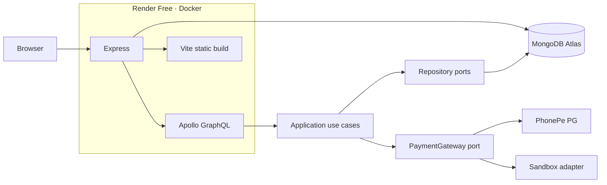
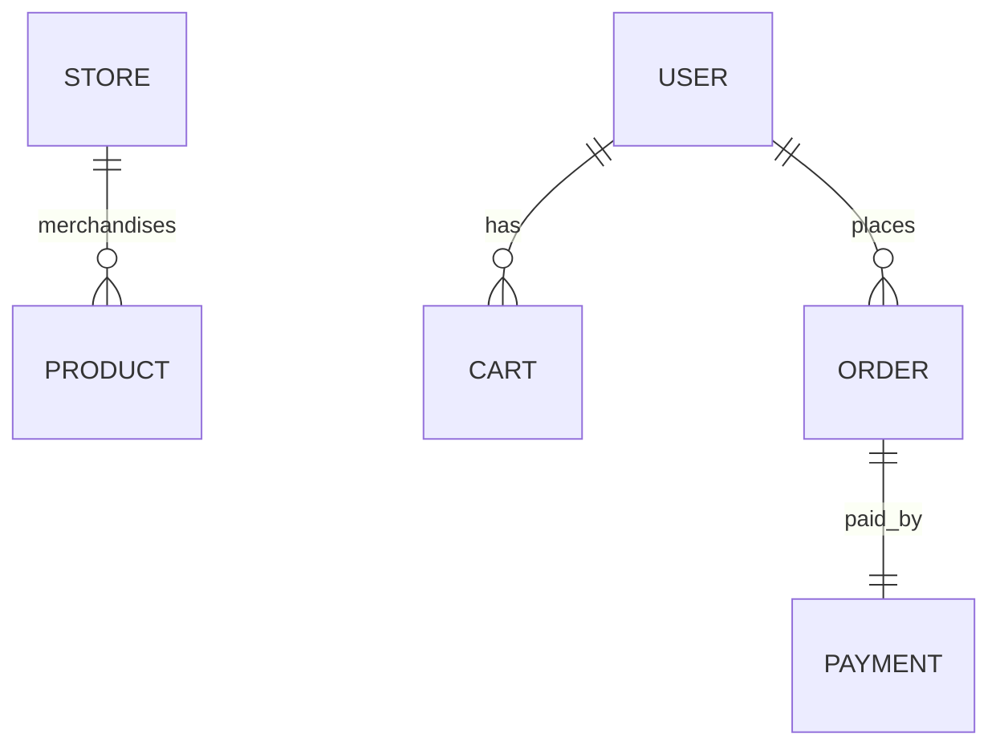

# Architecture

Boutique Market is a **white-label, single-tenant** boutique shop. Branding lives in MongoDB (`Store` document). The compiled app never assumes a boutique name.

## System

## Clean architecture

Dependencies point **inward**. Domain does not import Express, Mongoose, or Apollo.

| Layer | Path | Allowed to know |
|-------|------|-----------------|
| Domain | `apps/api/src/domain` | Entities, invariants, repository *interfaces* |
| Application | `apps/api/src/application` | Use cases, ports (`PaymentGateway`, `TokenService`, `ImageStore`) |
| Infrastructure | `apps/api/src/infrastructure` | MongoDB, JWT, PhonePe, GraphQL, Express |
| Composition | `apps/api/src/composition.ts` | Wires ports to adapters |

### Why this helps you become a pro

- **Swap MongoDB** by implementing the same repository interfaces.  
- **Swap PhonePe** by implementing `PaymentGateway` (the sandbox already does).  
- **GraphQL is a delivery mechanism**, not the business. Checkout rules live in `CheckoutUseCases`, not in resolvers.

## Domain model

Money is **integer paise** (`@boutique-market/shared` `Money`). Never `number` rupees with floats.

## Frontend

`apps/web` is a React SPA. Apollo Client talks to `/graphql`. `StoreProvider` loads `store` and sets `--accent` and `document.title`. No boutique name is hardcoded in components.

## Composition root

`compose()` constructs repositories, use cases, and the payment adapter. `main.ts` connects Mongo, seeds admin + optional demo catalog, then starts Express.
